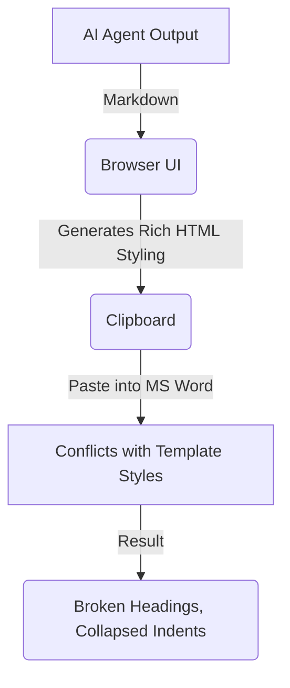

If you write documentation in a corporate environment — especially in highly regulated sectors like life sciences, medical devices, or aviation — you are intimately familiar with the rigid, fragile nature of Microsoft Word templates.

These templates are defined by corporate brand teams and quality departments to enforce visual uniformity. They contain predefined styles: specific fonts, margins, line spacings, heading hierarchies, and indented list styles. Under GxP (Good Practice) requirements, these layouts are strictly controlled.

When generative AI tools like ChatGPT or Claude arrived, engineers and quality writers rejoiced. Suddenly, drafting a 10-page operational procedure or software validation protocol took minutes instead of hours. 

But then they hit the **clipboard tax**.

---

## The Copy-Paste Nightmare

You generate a high-quality procedure draft in Claude. You click the "Copy" button (or highlight the text and press `Ctrl+C`). You open your company's official Word template, place your cursor in the "Procedure" section, and press `Ctrl+V`.

Then, chaos ensues:
* **Headings Collapse**: Your carefully formatted `## 2. Equipment Calibration` header turns into standard, double-spaced body text.
* **Lists Explode**: Nested, multi-level bullet lists lose their indentation. The sub-bullets shift to the left margin, or the numbering sequence resets itself to `1. 1. 1.` instead of `1.1.1.` or `a. b. c.`.
* **Marginal Chaos**: Word inherits hidden style properties from the browser clipboard, overriding the template's line-spacing and margins with custom fonts or background colors.

You are left with a choice: do you spend the next hour manually fixing every heading style, adjusting list tabs, and stripping hidden HTML styles, or do you go back to writing documents manually?

For most writers, this copy-paste clean-up takes longer than the actual drafting.

---

## Why Standard Copiers Break Word Templates

When you copy text from a web browser (where Claude and ChatGPT live), your computer's clipboard doesn't just copy the raw characters. It copies a rich HTML payload representing the browser's rendered styling.

Standard LLM outputs are formatted in Markdown, which the browser renders into HTML containing elements like `<h2>`, `<ul>`, and `<li>`. 

When you paste this HTML payload into Microsoft Word:
1. **Implicit Styles Override Explicit Styles**: Word tries to reconcile the browser's implicit inline margins and lists with Word's explicit template style definitions. Word usually loses this fight.
2. **List Level Conflation**: Browsers represent nested lists using nested `<ul>` tags. Word handles lists through paragraph tab stops and custom outline numberings. Copying a nested HTML list into Word fails to map to Word's internal outline levels, collapsing the hierarchy.
3. **Paragraph Style Bleed**: Because the clipboard contains rich text, Word applies "Normal" body text layout rules to headings, stripping the template's built-in "Heading 1" or "Heading 2" styles.

---

## The Solution: Focus on Content, Strip the Styling

The solution is not to build a smarter Word importer. The solution is to isolate the **semantic structure** of the text and strip away the formatting payload entirely before it ever hits the clipboard.

This is why we built **SOP Writer** (available at [sopwriter.gxpsoft.ai](https://sopwriter.gxpsoft.ai)). 

Instead of generating rich text, SOP Writer uses a specialized agentic workflow designed specifically for copy-paste preservation:

### 1. Style-Stripped Generation
The writing engine focuses exclusively on text content and hierarchy. It completely ignores margins, fonts, colors, and line-heights, writing a clean, structure-purity draft.

### 2. Clipboard Preserving Structure
When you click "Copy" in SOP Writer, the application writes a custom structure-only layout to the clipboard. This layout is designed to trigger Word's styling parser to say: *"This text has headings and list indentation levels, but has no custom fonts or margins. I will apply my own template styles to it."*

### 3. Nested List Preservation
By utilizing clean semantic nesting, SOP Writer translates multi-level lists into structures that Word translates cleanly into indent levels, preventing the alignment collapses typical of standard ChatGPT copy-pastes.

---

## Stop Wrestling With Word Margins

Software engineering shifted from manual assembly to automation. Document drafting is undergoing the same transition. But automation is only as good as the interfaces connecting our tools. 

If you are a quality manager or process engineer who is tired of spending hours reformatting AI output to fit your rigid corporate templates, SOP Writer is built for you. Focus on the procedural content, and let us handle the clipboard.

Try it live today at [sopwriter.gxpsoft.ai](https://sopwriter.gxpsoft.ai). For custom corporate templates, private enterprise instances, or CSV validation support, email our team at [duke.lee@saram.io](mailto:duke.lee@saram.io).
