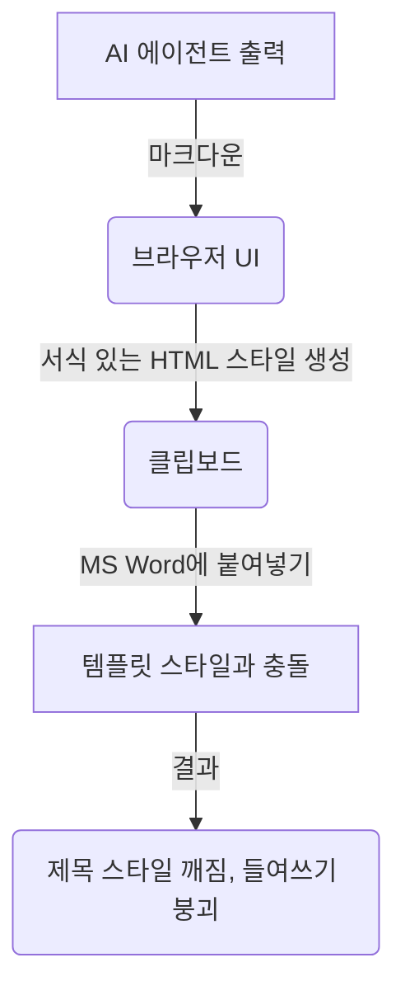

기업 환경, 특히 생명과학, 의료기기, 항공과 같이 규제가 엄격한 분야에서 문서를 작성해 본 경험이 있다면, 마이크로소프트 워드(Microsoft Word) 템플릿이 얼마나 엄격하고 쉽게 깨지는지 잘 알고 계실 것입니다.

이러한 템플릿은 시각적 일관성을 유지하기 위해 기업 브랜드 팀과 품질 부서에 의해 엄격히 정의됩니다. 특정 글꼴, 여백, 줄 간격, 제목 계층 구조, 들여쓰기된 목록 스타일 등 사전 정의된 스타일이 포함되어 있습니다. GxP(Good Practice) 규제 요건에 따라 이러한 레이아웃은 엄격한 변경 제어 하에 관리됩니다.

ChatGPT나 Claude 같은 생성형 AI 툴이 등장했을 때 엔지니어와 품질 문서 작성자들은 환호했습니다. 10페이지 분량의 운영 절차서나 소프트웨어 밸리데이션 프로토콜 초안을 작성하는 데 며칠이 아닌 몇 분밖에 걸리지 않게 되었기 때문입니다.

하지만 곧 그들은 **클립보드 세(Clipboard Tax)**라는 장벽에 부딪히게 되었습니다.

---

## 복사-붙여넣기의 악몽

Claude에서 고품질 절차서 초안을 생성합니다. "복사(Copy)" 버튼을 클릭하거나 텍스트를 드래그하여 `Ctrl+C`를 누릅니다. 회사의 공식 Word 템플릿을 열고 "절차(Procedure)" 섹션에 커서를 놓은 뒤 `Ctrl+V`를 누릅니다.

그 순간, 대혼란이 시작됩니다:
* **제목 서식 붕괴**: 정성스럽게 서식화된 `## 2. 장비 교정` 제목이 기본 줄 간격의 일반 본문 텍스트로 변합니다.
* **목록 체계 파괴**: 중첩된 다단계 글머리 기호 목록의 들여쓰기가 사라집니다. 하위 글머리 기호가 왼쪽 여백으로 밀려나거나, 번호 체계가 `1.1.1.`이나 `a. b. c.` 대신 `1. 1. 1.`로 리셋됩니다.
* **여백 및 서식 오염**: Word가 브라우저 클립보드로부터 숨겨진 스타일 속성을 그대로 상속받아, 템플릿 고유의 줄 간격과 여백을 덮어쓰고 원치 않는 글꼴이나 배경색을 적용해 버립니다.

결국 작성자는 선택의 기로에 섭니다: 다음 한 시간 동안 제목 스타일을 일일이 수작업으로 수정하고 목록 탭을 맞추며 숨겨진 HTML 스타일을 지울 것인가, 아니면 처음부터 수동으로 문서를 작성하던 방식으로 되돌아갈 것인가?

대부분의 작성자에게 이러한 복사-붙여넣기 후처리 작업은 실제 초안 작성보다 더 오랜 시간이 걸립니다.

---

## 일반 복사 방식이 Word 템플릿을 깨뜨리는 이유

Claude나 ChatGPT가 구동되는 웹 브라우저에서 텍스트를 복사할 때, 컴퓨터 클립보드는 단순한 텍스트 문자열만 복사하지 않습니다. 브라우저가 렌더링한 서식 정보가 담긴 풍부한 HTML 페이로드(Payload)를 함께 복사합니다.

표준 LLM 출력은 마크다운(Markdown)으로 형식화되며, 브라우저는 이를 `<h2>`, `<ul>`, `<li>` 등의 요소를 포함하는 HTML로 렌더링합니다.

이 HTML 페이로드를 Microsoft Word에 붙여넣으면 다음과 같은 문제가 발생합니다:
1. **암묵적 스타일이 명시적 스타일을 덮어씀**: Word는 브라우저의 암묵적인 인라인 여백 및 목록을 Word 고유의 템플릿 스타일 정의와 조율하려 시도합니다. 그리고 대부분의 경우 Word가 이 싸움에서 패배합니다.
2. **목록 레벨 혼선**: 브라우저는 중첩된 `<ul>` 태그를 사용해 다단계 목록을 표현합니다. 반면 Word는 단락 탭 정렬과 고유한 개요 번호 매기기를 통해 목록을 처리합니다. 중첩된 HTML 목록을 Word로 복사하면 Word 내부 개요 레벨과 매핑되지 않아 계층 구조가 무너집니다.
3. **단락 스타일 오염(Style Bleed)**: 클립보드에 리치 텍스트가 포함되어 있기 때문에, Word는 제목에도 "Normal" 본문 텍스트 레이아웃 규칙을 적용하여 템플릿 고유의 "제목 1" 또는 "제목 2" 스타일을 무력화시킵니다.

---

## 해결책: 서식을 제거하고 내용과 구조에 집중하기

해결책은 더 똑똑한 Word 임포터를 만드는 것이 아닙니다. 텍스트의 **시맨틱 구조(Semantic Structure)**를 분리하고, 텍스트가 클립보드에 들어가기 전에 서식 페이로드를 완전히 제거하는 것입니다.

이것이 바로 저희가 **SOP Writer**([sopwriter.gxpsoft.ai](https://sopwriter.gxpsoft.ai))를 구축한 이유입니다.

SOP Writer는 서식이 포함된 리치 텍스트를 생성하는 대신, 복사-붙여넣기 시 서식 보존을 위해 특별히 설계된 에이전트 워크플로우를 사용합니다:

### 1. 스타일이 제거된 순수 구조 생성
작성 엔진은 오직 텍스트 내용과 계층 구조에만 집중합니다. 여백, 글꼴, 색상, 행간을 완전히 배제하고 구조적으로 순수한 초안을 작성합니다.

### 2. 구조 보존형 클립보드 처리
SOP Writer에서 "복사"를 클릭하면 애플리케이션은 구조 정보만을 담은 레이아웃을 클립보드에 기록합니다. 이 레이아웃은 Word의 스타일 파서가 다음과 같이 인식하도록 유도합니다: *"이 텍스트에는 제목과 목록 들여쓰기 레벨이 있지만 별도의 글꼴이나 여백 스타일은 없다. 여기에 내 고유 템플릿 스타일을 그대로 적용하겠다."*

### 3. 중첩 목록의 완벽한 보존
깔끔한 시맨틱 중첩을 활용함으로써 SOP Writer는 다단계 목록을 Word가 들여쓰기 레벨로 깨끗하게 변환할 수 있는 구조로 매핑합니다. 이를 통해 일반 ChatGPT 복사-붙여넣기에서 흔히 발생하는 정렬 붕괴를 원천 방지합니다.

---

## Word 서식과의 씨름을 멈추십시오

소프트웨어 엔지니어링이 수작업 조립에서 자동화로 전환되었듯, 규제 문서 작성 역시 동일한 변화를 겪고 있습니다. 하지만 자동화의 가치는 도구들을 잇는 인터페이스가 매끄러울 때에만 발휘됩니다.

AI 출력을 엄격한 기업 템플릿에 맞추기 위해 서식을 다시 다듬느라 몇 시간씩 허비하는 데 지치셨다면, 품질 관리자와 공정 엔지니어를 위해 탄생한 SOP Writer를 경험해 보십시오. 여러분은 절차서 본연의 내용에 집중하시고, 클립보드 문제는 시스템에 맡기시기 바랍니다.

지금 [sopwriter.gxpsoft.ai](https://sopwriter.gxpsoft.ai)에서 직접 체험해 보실 수 있습니다. 기업 맞춤형 템플릿 연동, 프라이빗 엔터프라이즈 인스턴스 구축, 또는 CSV 밸리데이션 지원이 필요하시다면 저희 팀([duke.lee@saram.io](mailto:duke.lee@saram.io))으로 문의해 주시기 바랍니다.
