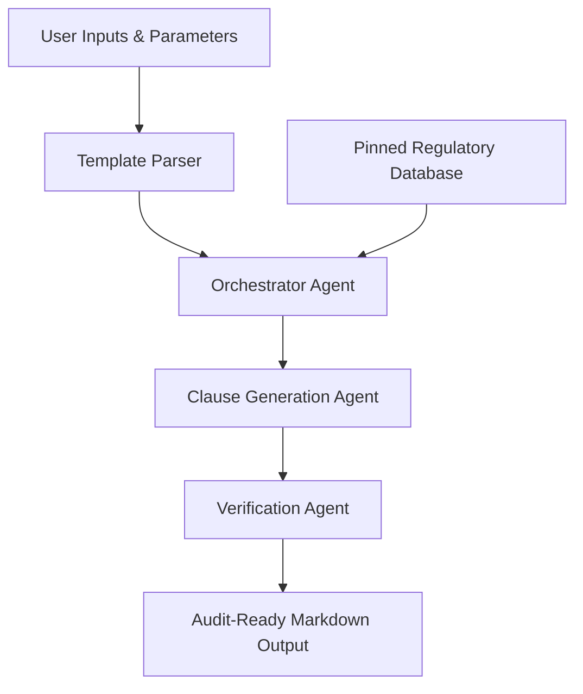

Standard Operating Procedures (SOPs) are the bedrock of operational consistency and regulatory compliance in life sciences, biotechnology, and pharmaceutical manufacturing. Yet, if you ask any quality manager or validation engineer, they will tell you the same thing: writing, updating, and maintaining SOPs is one of the most resource-intensive bottlenecks in the industry. 

A single new SOP for a bioreactor setup, cleaning validation protocol, or a software system backup routine can take weeks or even months to move from initial draft to final electronic signature. The reason is simple: the stakes are too high for mistakes, and the regulatory requirements are uncompromising.

In the era of generative AI, the temptation to solve this with a generic large language model (LLM) is strong. But in a GxP (Good Practice) environment, naive AI usage is not just ineffective — it is a regulatory liability.

This post explores the engineering challenges of automating SOP drafts, why standard ChatGPT-style workflows fail under audit, and how we built a structured, compliant orchestration pattern in our new tool, **SOP Writer** (available at [sopwriter.gxpsoft.ai](https://sopwriter.gxpsoft.ai)).

---

## The High Cost of the Blank Page

In a regulated facility, an SOP is not a casual set of instructions. It is a legal document. Under FDA regulations (such as **21 CFR 211.100** for drug manufacturing and **21 CFR 820.20** for medical devices), written procedures must be established, followed, and documented to ensure identity, strength, quality, and purity. 

When a quality engineer sits down to write a new procedure, they face several hurdles:
1. **Structural Rigidity**: An SOP must follow strict organizational layouts, containing explicit sections for Document Headers, Scope, Responsibilities, Definitions, Materials, Step-by-Step Procedure, References, and Revision History tables.
2. **Regulatory Alignment**: The procedure must directly reference and comply with specific regulations (e.g., EU Annex 11 for computerized systems or ALCOA+ principles for data integrity).
3. **Cross-Functional Input**: It must synthesize engineering specifications, safety guidelines, and quality assurance guardrails without introducing contradictions.

Drafting from scratch leads to the "blank-page syndrome," where authors copy-paste outdated sections from other procedures, inadvertently carrying over legacy errors or obsolete formatting.

---

## Why Naive AI Fails Under Audit

If you feed an engineering manual to a standard generative AI tool and ask it to "write an SOP," the result will likely look plausible on the surface but fail a basic quality audit. 

There are three primary reasons generic LLM wrappers cannot be used for GxP documentation:

### 1. Hallucinated Regulations
LLMs are probabilistic word-prediction engines. When asked to cite regulatory sections, they frequently fabricate paragraph numbers or conflate FDA guidelines with ISO standards. An auditor encountering a fabricated regulatory reference (e.g., "per 21 CFR 211.1234") will immediately flag the entire document control system as uncontrolled.

### 2. Lack of Reproducibility (Non-Determinism)
If two engineers enter the same process details into a generic LLM on different days, they will receive different procedures. One might contain critical safety steps while the other omits them. In a validated system, processes must be reproducible. The writing tool itself must have predictable, version-controlled behavior.

### 3. Data Integrity & Privacy Risks
Uploading proprietary manufacturing steps, laboratory formulations, or internal server configurations to public AI APIs violates basic corporate IP rules and data integrity principles. Under GxP, you must guarantee that customer data is not used to train models accessible by other entities.

---

## The 4-Part Orchestrated Pattern for SOP Writing

To bridge the gap between LLM creativity and regulatory determinism, we designed **SOP Writer** using a structured orchestration pattern. Instead of letting the AI write freely, we constrain the model using a strict engineering harness.

This pattern consists of four critical guardrails:

### 1. Template-Driven Grounding
SOP Writer does not start with a blank prompt. The orchestrator loads a validated document template scheme that defines the exact sections, table headers, and structural rules required. The AI is only allowed to fill in specific nodes within this structured tree, ensuring that critical sections like "Responsibilities" and "Revision History" are never omitted.

### 2. Pinned Regulatory Databases
Instead of asking the LLM to recall regulations from its pre-training weights, SOP Writer uses a Retrieval-Augmented Generation (RAG) architecture. We host a curated, read-only database of key regulations (FDA CFRs, EU EudraLex, GAMP 5, ISO 13485). When a user selects their target compliance frameworks, the system retrieves the exact, verified text of the rules and injects them into the agent's context as anchor points.

### 3. Version-Controlled Prompts and Models
To maintain consistency, we pin the foundation models (e.g., specific versions of Anthropic Claude or open-weights models) and version all prompt templates, parser codes, and tool APIs as Configuration Items (CIs). Any update to the writing logic undergoes regression testing against an automated evaluation suite to ensure that changes do not alter formatting or omit safety steps.

### 4. Human-in-the-Loop (HITL) as an Architectural Requirement
In compliance with the **FDA Purolea Warning Letter (April 2, 2026)**, which explicitly notes that AI-assisted documents must be thoroughly reviewed for CGMP compliance, SOP Writer does not integrate with auto-publishing document control systems. The tool generates draft procedures in an interactive browser editor. The AI is the *co-pilot*, but the quality engineer remains the sole author who must review, edit, and approve the document before exporting it for electronic signatures.

---

## Introducing GxPSoft AI's SOP Writer

To put these principles into practice, we are launching **SOP Writer** as a dedicated utility under our product line. Located at [sopwriter.gxpsoft.ai](https://sopwriter.gxpsoft.ai), the tool provides a clean, web-based workspace designed specifically for life science professionals:

* **Pre-Validated GxP Templates**: Templates optimized for lab operations, cleanroom procedures, change control, and backup/restore protocols.
* **Target Compliance Selectors**: Ground your procedures in FDA 21 CFR Part 11, Part 210/211, Part 820, or EU Annex 11 with a single click.
* **Interactive Draft Editor**: Edit, re-arrange, and refine the generated markdown sections before exporting.
* **Format Exports**: Download your finalized documents in clean Markdown, Microsoft Word (.docx), or print-ready PDF.

SOP Writer is currently in **Early Alpha** and is free to use. We encourage QA managers, validation engineers, and lab directors to test it with their processes and share feedback.

For organizations requiring on-premises hosting, private VPC deployments (AWS/Azure), or complete Computer System Validation (CSV) protocols, please reach out to us at [duke.lee@saram.io](mailto:duke.lee@saram.io).
